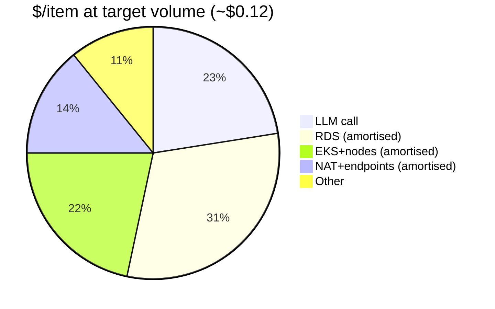

# Cost model — target ≤ $1.50 / item at p50

Target: agent cost (compute + LLM) ≤ **$1.50/item** at p50. Baseline being
replaced: ~$14/item of loan-officer time. Volume used below is the **12-month
target**: 5,000 loans/mo × ~4 items = **~20,000 items/mo**.

## Marginal cost per item (scales with volume)

| Component | Assumption | $/item |
| --- | --- | --- |
| LLM call (Claude Sonnet via Bedrock) | ~4k input + ~1k output tokens (~$3/M in, ~$15/M out) | **~$0.027** |
| Compute (EKS node CPU·s) | light per-item work, ~2–4s mostly LLM-wait | ~$0.005 |
| S3 / DynamoDB / SES / data transfer | a few small ops + 1 email | ~$0.005 |
| **Marginal subtotal** | | **~$0.04** |

## Fixed cost, amortised over 20,000 items/mo

| Component | ~$/mo | $/item |
| --- | --- | --- |
| RDS Postgres (Multi-AZ, db.r6g.large) | ~$730 | $0.037 |
| EKS control plane + system nodes (3× m6i.large) | ~$520 | $0.026 |
| NAT (3 AZ) + VPC endpoints | ~$330 | $0.017 |
| Observability, KMS, secrets, misc | ~$120 | $0.006 |
| **Fixed subtotal** | ~$1,700 | **~$0.085** |

## All-in

**≈ $0.12 / item at the 12-month target volume** — comfortably inside the $1.50
ceiling (~12× headroom) and ~100× cheaper than the $14 manual baseline.

## What this tells us
- **Cost is fixed-infra-dominated, not LLM-dominated, at this scale.** The
  marginal item is ~$0.04; the bill is mostly the always-on RDS + cluster.
- **Today's volume (500 loans/mo ≈ 2,000 items)** amortises the same ~$1,700
  fixed over 10× fewer items → ~$0.9/item — *still under $1.50*, but the reason
  to right-size non-prod aggressively.

## Levers if we needed to cut further
- **Non-prod:** spot system nodes + Karpenter consolidation + single NAT + small
  single-AZ RDS (already configured for dev/staging).
- **Prod fixed cost:** Graviton RDS (already r6g), single-NAT if the AZ-HA
  trade-off is acceptable, Savings Plans / Reserved for the steady system pool.
- **LLM:** prompt-caching and right-sized model per item-category; cheaper model
  for low-ambiguity categories, escalate only the hard ones.

> Figures are planning estimates (us-east-1, on-demand list) to demonstrate the
> method and that the target is met with large margin — not a billing forecast.
