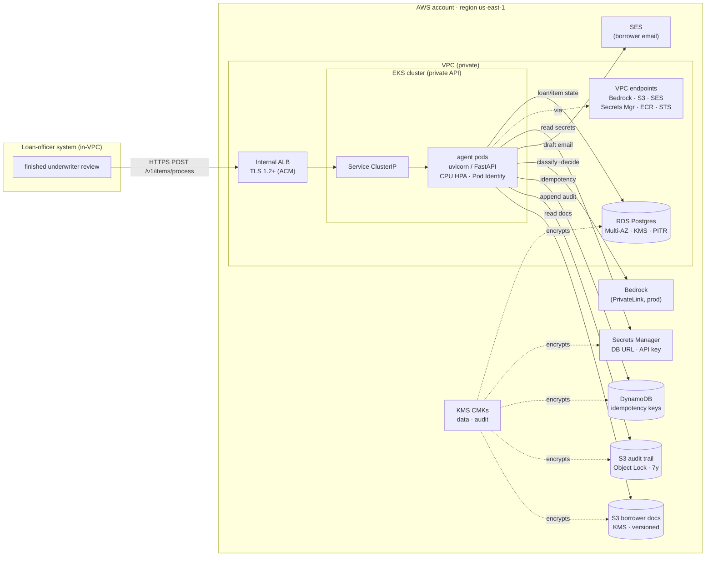
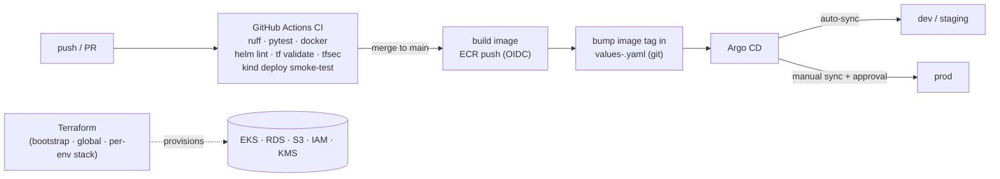
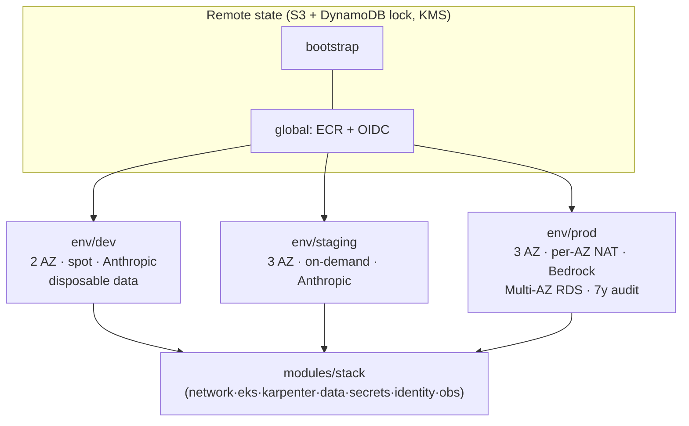

# Architecture

## Runtime (request path + dependencies)

Synchronous request/response — the agent's native contract. We **deploy and
operate** the agent as shipped; we do not place a queue in front (that would
require building a consumer, which is out of scope). If arrival outgrows
synchronous serving, the documented evolution is SQS + a queue-depth scaler.

## Delivery (how code reaches the cluster)

## Environment separation

Each environment is a separate state file and (recommended) a separate AWS
account; the composition lives once in `modules/stack` and is parameterised per
env. No production data ever lands in non-prod (separate accounts + synthetic
dev data + `force_destroy` only in dev).
