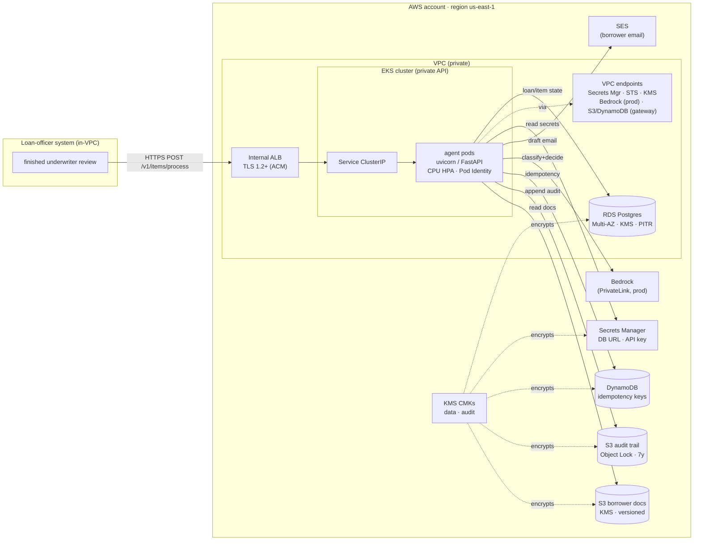
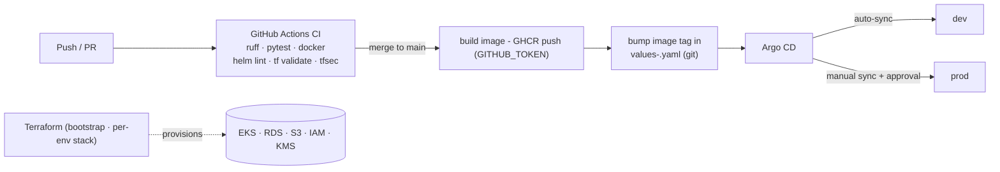

# Architecture

## Runtime (request path + dependencies)



Synchronous request/response — the agent's native contract. We **deploy and
operate** the agent as shipped; we do not place a queue in front (that would
require building a consumer, which is out of scope). If arrival outgrows
synchronous serving, the documented evolution is SQS + a queue-depth scaler.

## Network traffic flow (where packets actually go)

### The actors in your VPC

- **Agent pod** — runs in a **private subnet** (`10.x.1-3`, has NAT egress).
- **Interface endpoint ENIs** — live in the **intra subnets** (`10.x.51-53`, no egress).
- **NAT gateway** — in the **public subnets**, for normal internet traffic.

### Flow A — Agent → Bedrock (PrivateLink, prod)

1. Agent SDK calls `bedrock-runtime.<region>.amazonaws.com`.
2. DNS lookup → because `private_dns_enabled = true`, Route 53 returns the
   **private IP of the endpoint ENI** (e.g. `10.x.51.x`), not a public IP.
3. Packet leaves the pod → routed within the VPC to that ENI in the intra subnet.
4. **Security group** check on the endpoint → allows `443` from inside the VPC CIDR → passes.
5. The ENI hands traffic to AWS **PrivateLink**, which carries it over the AWS
   internal backbone to Bedrock's service.
6. Response returns the same way. Never touches the internet, NAT, or IGW.

```
Agent pod (private subnet)
   │  DNS → private ENI IP (private_dns_enabled)
   ▼
Interface endpoint ENI (intra subnet)  ──SG: 443 from VPC──►  PrivateLink
   │                                                              │
   └──────────────── AWS backbone (no internet) ─────────────────► Bedrock
```

### Flow B — Agent → S3 (gateway endpoint)

1. Agent calls S3 (borrower docs / audit bucket).
2. There's **no ENI** here — instead the **route table** has an entry: S3's
   prefix list → the gateway endpoint.
3. Traffic follows that route → onto the AWS backbone → S3. Also no internet, and free.
4. (Difference vs Flow A: **routing-based, not DNS+ENI based**.)

### Flow C — Agent → Anthropic API (dev only)

1. No Bedrock endpoint in dev (`enable_bedrock_endpoint = false`).
2. Agent reads the API key from **Secrets Manager** (which *does* go via a private endpoint).
3. The actual LLM call to `api.anthropic.com` → no PrivateLink exists → routes to
   the **NAT gateway** → internet → Anthropic.

### Flow D — Inbound request → Agent (who calls the agent)

1. A caller hits `agent[.dev].internal.saaffinance.com` (`scheme: internal`).
2. Resolves to the **internal ALB** (private, not internet-facing).
3. ALB → routes to the Service (ClusterIP `:80`) → pod `targetPort 8080`.
4. Pod runs `POST /v1/items/process`.
5. This is the path that would become a PrivateLink *provider* flow if you ever
   exposed the agent to another VPC (would need an NLB in front).

### The key mental split

| Path | Mechanism | Hits internet? |
| --- | --- | --- |
| Bedrock, KMS, STS, Secrets (prod) | Interface endpoint (ENI + private DNS) | no |
| S3 | Gateway endpoint (route table) | no |
| Anthropic API (dev), GHCR images | NAT gateway | yes |
| Inbound to agent | Internal ALB → Service → pod | no (internal) |

We are a **PrivateLink consumer only** — `aws_vpc_endpoint` (interface/gateway),
no `aws_vpc_endpoint_service`. Exposing the agent *as* a PrivateLink service to
another VPC would require an NLB in front + an endpoint service; not in scope.

## Delivery (how code reaches the cluster)



## Environment separation: dev vs prod

Both environments are built from the **same `modules/stack`** composition,
parameterised per env, and share the baseline: Kubernetes 1.32, region
`us-east-1`, EKS Pod Identity, KMS on every store, and an internal ALB. They
differ where it matters for cost (dev) vs HA/compliance (prod):

| Dimension | dev | prod |
| --- | --- | --- |
| Purpose / data | R&D, **synthetic** data | production, **real borrower PII** |
| VPC CIDR | `10.10.0.0/16` | `10.30.0.0/16` |
| AZs | 2 | 3 |
| NAT gateways | single (cost) | one per AZ (no SPOF) |
| System nodes | `t3.large` **spot**, 1–3 | `m6i.large` **on-demand**, 3–6 |
| RDS | `db.t3.medium`, single-AZ, 20 GB, 1-day backup, no deletion protection | `db.r6g.large`, **Multi-AZ**, 100–500 GB, 14-day backup + PITR, deletion protection |
| LLM provider | **Anthropic API** (key from Secrets Manager, over NAT) | **Bedrock** via PrivateLink (IAM, no key) |
| Bedrock VPC endpoint | — | yes |
| Agent replicas / HPA | 1 · HPA 1–5 @ 65% | 3 · HPA 3–40 @ 60% |
| Pod resources (req → limit) | 250m / 512Mi → 1Gi | 500m / 768Mi → 1.5Gi |
| HA hardening | none | PDB (minAvailable 2) + AZ topology spread |
| Ingress host | `agent.dev.internal.saaffinance.com` | `agent.internal.saaffinance.com` |
| Log level | `DEBUG` | `INFO` |
| Data lifecycle | `force_destroy = true` (disposable) | `force_destroy = false`, 7-yr WORM audit |
| Argo CD sync | auto-sync + self-heal | manual sync + GitHub Environment approval |
| Availability target | best-effort | 99.9% |
| Cost-center tag | `underwriting-rnd` | `underwriting-platform` |

Each environment is a separate state file and (recommended) a separate AWS
account. No production data ever lands in non-prod (separate accounts + synthetic
dev data + `force_destroy` only in dev).
